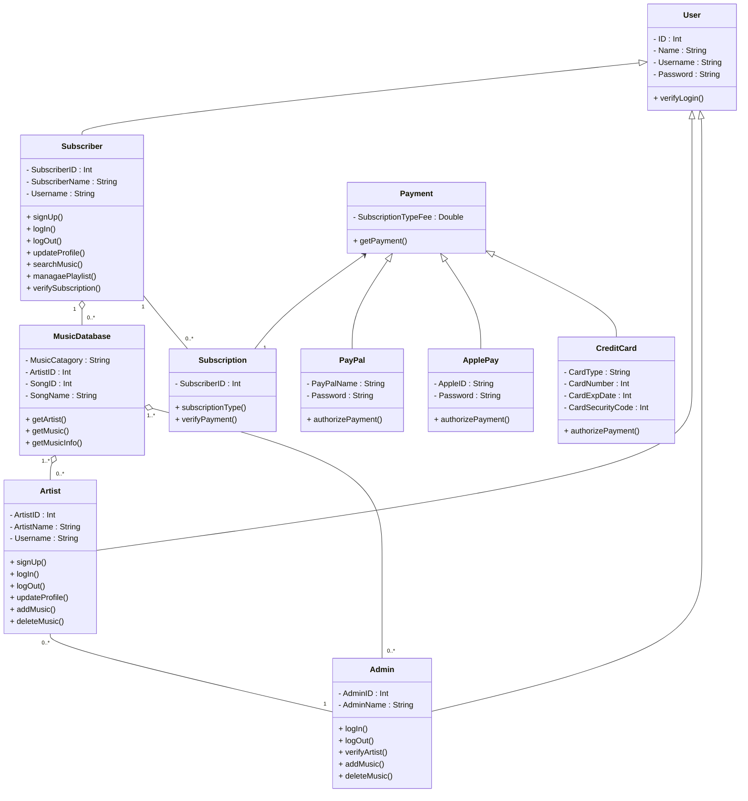

# cs-250-project

```mermaid
classDiagram
    User <|-- Subscriber
    User <|-- Artist
    User <|-- Admin

    Artist "0..*" -- "1" Admin
    MusicDatabase "1..*" o-- "0..*" Artist
    MusicDatabase "1..*" o-- "0..*" Admin
    Subscriber "1" o-- "0..*" MusicDatabase
    Subscriber "1" -- "0..*" Subscription
    Payment "1..*" <-- "1" Subscription
    
    Payment <|-- PayPal
    Payment <|-- ApplePay
    Payment <|-- CreditCard

    class User{
        - ID : Int
        - Name : String
        - Username : String
        - Password : String
        + verifyLogin()
    }
    class Subscriber{
        - SubscriberID : Int
        - SubscriberName : String
        - Username : String
        + signUp()
        + logIn()
        + logOut()
        + updateProfile()
        + searchMusic()
        + managaePlaylist()
        + verifySubscription()
    }
    class Artist{
        - ArtistID : Int
        - ArtistName : String
        - Username : String
        + signUp()
        + logIn()
        + logOut()
        + updateProfile()
        + addMusic()
        + deleteMusic()
    }
    class Admin{
        - AdminID : Int
        - AdminName : String
        + logIn()
        + logOut()
        + verifyArtist()
        + addMusic()
        + deleteMusic()
    }
    class MusicDatabase{
        - MusicCatagory : String
        - ArtistID : Int
        - SongID : Int
        - SongName : String
        + getArtist()
        + getMusic()
        + getMusicInfo()
    }
    class Subscription{
        - SubscriberID : Int
        + subscriptionType()
        + verifyPayment()
    }
    class Payment{
        - SubscriptionTypeFee : Double
        + getPayment()
    }
    class PayPal{
        - PayPalName : String
        - Password : String
        + authorizePayment()
    }
    class ApplePay{
        - AppleID : String
        - Password : String
        + authorizePayment()
    }
    class CreditCard{
        - CardType : String
        - CardNumber : Int
        - CardExpDate : Int
        - CardSecurityCode : Int
        + authorizePayment()
    }
```
